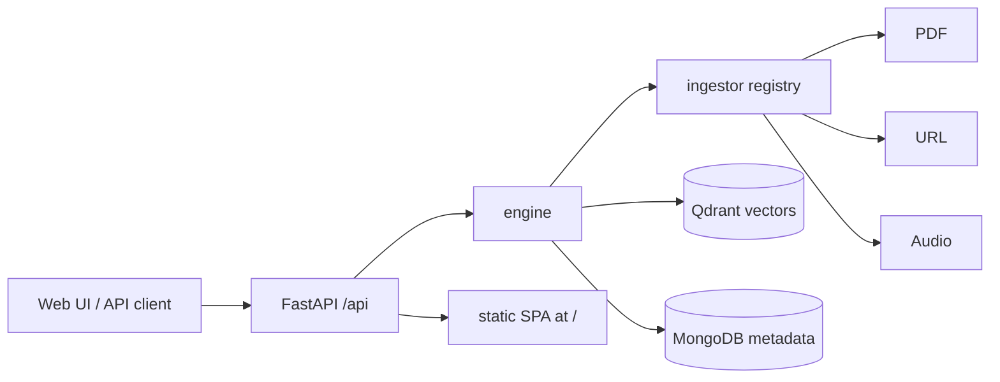
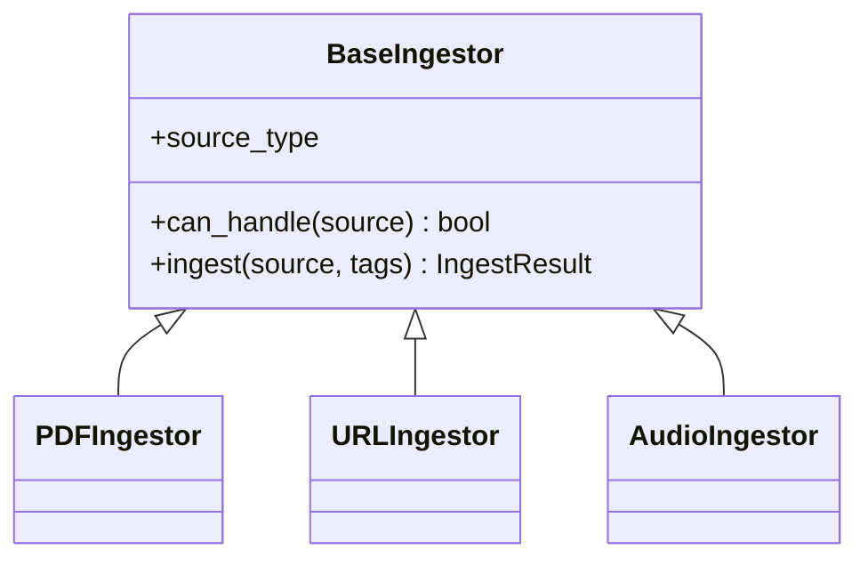

# Architecture

Local RAG is a FastAPI application with a dual datastore, a self-registering ingestor-plugin backend, and a manifest-driven ES-module frontend. Everything runs locally and CPU-only.

## High-level flow



## Process entry & lifecycle

- Entry point: `start-rag-server` → `local_rag.main:start` → `uvicorn` on `0.0.0.0:8000`.
- `main.py` builds the FastAPI app, mounts the `/api` router, serves the SPA at `/` and assets at `/static`.
- On startup (`lifespan`): `engine.init_db()` (Qdrant collection + indexes) then `store.init_store()` (MongoDB ping; warns if unavailable).
- Heavy models are module-level **singletons** loaded once when `engine` is imported: the dense embedder, sparse embedder, Docling converter + chunker, and the Whisper model. They are never instantiated per-request.

## Dual store

| Store    | Role                                                                 | Failure behavior                                  |
| -------- | ------------------------------------------------------------------- | ------------------------------------------------- |
| Qdrant   | All vectors; **source of truth** for retrieval.                     | Required for ingest/search.                       |
| MongoDB  | Document metadata + full extracted text/transcript for the UI.      | **Non-critical** — writes are suppressed on error; search still works, UI metadata degrades. |

MongoDB writes from ingestors are wrapped in `contextlib.suppress(Exception)`, so a Mongo outage never breaks ingestion or search. The MongoDB document `_id` is the filename/source id; records follow the `DocumentRecord` schema (filename, source_type, tags, chunk_count, ingested_at, markdown_content, source_url, content_hash).

## Qdrant collection schema

Collection: `local_agent_knowledge`. It declares **three named vectors**:

| Vector        | Size | Distance | Produced by                                         |
| ------------- | ---- | -------- | --------------------------------------------------- |
| `dense`       | 768  | COSINE   | FastEmbed `nomic-ai/nomic-embed-text-v1.5`.         |
| `sparse`      | —    | IDF      | FastEmbed `Qdrant/bm25` (sparse).                   |
| `spectrogram` | 128  | COSINE   | librosa log-mel summary (audio only).               |

Every point must carry all named vectors. Non-audio sources (PDF/URL) write a **zero-padded** `spectrogram` (`[0.0] * 128`). For audio, only **chunk 0** carries the real spectrogram vector (it is a file-level feature); other chunks are zero-padded.

> The `spectrogram` vector is **stored but not yet queried** by any endpoint. It exists so the collection schema is ready for future audio-similarity search without another migration.

**Payload** per point: `text`, `source`, `chunk_index`, `tags` (and `source_type` for audio). Keyword payload indexes are created on `source`, `tags`, and `node_type` to support filtered queries and per-source deletes.

### Migration guard

Qdrant cannot add a named vector to an existing collection. `engine.init_db()` therefore:

1. If the collection does not exist → create it with `dense` + `spectrogram` + `sparse` and the payload indexes.
2. If it exists but lacks `spectrogram` → print instructions and raise `RuntimeError` to **block startup** (no silent data loss). The operator deletes the collection and re-ingests:
   ```bash
   curl -X DELETE http://localhost:6333/collections/local_agent_knowledge
   ```

> **On-disk format note:** Qdrant 1.18 cannot load segment data written by much older versions (e.g. 1.9), so upgrading the image on top of an old `./qdrant_storage` causes the container to crash-loop before it can serve the REST delete above. In that case clear `./qdrant_storage` and re-ingest (vectors only live in Qdrant; MongoDB content is unaffected).

## Search topologies

`engine.search()` dispatches on `SearchQuery.mode`:

- `dense` / `sparse` — single-vector query via the classic `search()` API.
- `hybrid` (default) — `query_points()` with a `FusionQuery(RRF)` prefetching both `dense` and `sparse`. RRF fusion requires **Qdrant ≥ 1.10** (Compose pins `v1.18.0`).

Optional `tags` are translated into a Qdrant `Filter` (must-match) applied to all modes.

## Ingestor plugin system



- `BaseIngestor.__init_subclass__` auto-registers each concrete subclass into a singleton `registry` (`ingestors/base.py`).
- `ingestors/__init__.py` imports `audio`, `pdf`, `url` for their registration side effects; `engine` imports the package at the bottom of the module.
- `engine.ingest(source, tags, **kwargs)` asks the registry for the first ingestor whose `can_handle(source)` is true, then delegates.

| Ingestor | Routing (`can_handle`)            | Pipeline                                                                                  |
| -------- | --------------------------------- | ---------------------------------------------------------------------------------------- |
| PDF      | suffix `.pdf`                     | Docling convert → `HybridChunker` → dense+sparse embed → upsert → Mongo upsert.           |
| URL      | starts with `http://`/`https://`  | `httpx` fetch → `trafilatura` (fallback `markdownify`) → char chunk (1500/200) → embed.   |
| Audio    | suffix `.mp3/.wav/.m4a/.ogg`      | `faster-whisper` transcribe → librosa spectrogram → char chunk (1500/200) → embed.        |

Each ingestor deletes prior points for the same `source` before upserting (idempotent re-ingest), then writes a `DocumentRecord` to MongoDB.

## Frontend

A dependency-free, native ES-module plugin system (one Tabler-icons CDN stylesheet; no bundler).

- `index.html` is a thin shell with slots: `#slot-sidebar`, `#panel-tabs` + `#slot-panel`, `#modal-root`, `#toast-root`.
- `js/main.js` wires core services and loads the plugin manifest.
- `js/plugins.js` is the **manifest** — the single place to register a UI plugin by its module URL.
- `js/core/host.js` loads each plugin module, injects its `styleUrl`, fetches its `templateUrl`, and mounts it into its declared slot (`sidebar`, `panel`, or `ingest`).
- Core services (`js/core/`): `api`, `state`, `bus`, `dom`, `notify`, `modal`, `tags`.

| Plugin         | Slot    | Purpose                                             |
| -------------- | ------- | --------------------------------------------------- |
| `library`      | sidebar | Document list, tag/mode filters, "add source".      |
| `search`       | panel   | Query input, mode toggle, results.                  |
| `reader`       | panel   | Full document/transcript view.                      |
| `ingest-pdf`   | ingest  | PDF upload tab in the "add source" modal.           |
| `ingest-url`   | ingest  | URL ingest tab.                                     |
| `ingest-audio` | ingest  | Audio upload tab (with transcription loading state).|

Ingest plugins (slot `ingest`) are rendered as tabs inside a single shared "add source" modal. Adding a new ingestor UI is a drop-in folder plus one line in `js/plugins.js`, mirroring the backend registry.

## Configuration

Environment variables (defaults in `config.py`): `QDRANT_HOST` (`localhost`), `MONGO_URI` (`mongodb://localhost:27017`), `MONGO_DB` (`rag`). Collection name: `local_agent_knowledge`. Ports: API `8000`, Qdrant REST `6333`, MongoDB `27017`.
